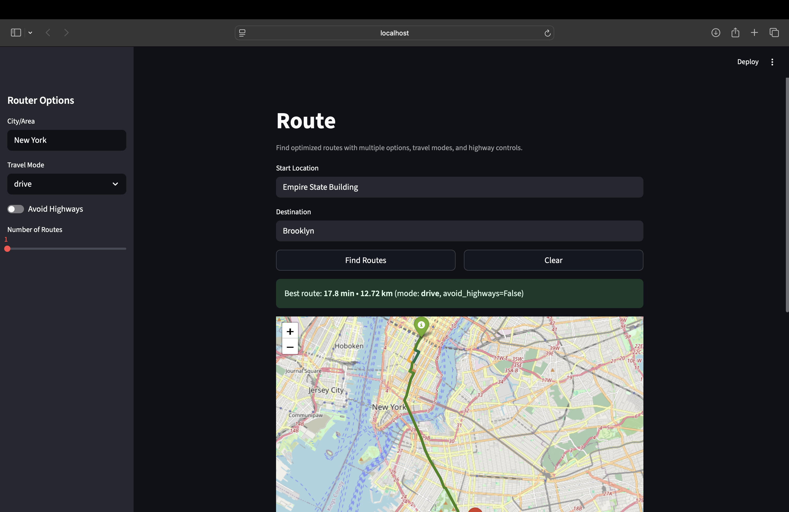

# Route

Interactive routing application built with Python, Streamlit, and OpenStreetMap (OSM).  
Computes multiple optimized routes between two places with support for travel modes and highway controls.

  

## Key Features
- Multiple route suggestions (K-shortest simple paths) ranked by travel time and distance
- Travel modes: drive, bike, walk (mode-specific edge weighting)
- Optional “avoid highways” filter based on OSM road classes
- Turn-by-turn summaries from OSM road names
- Interactive map visualization with Folium
- GeoJSON export for the best route

## Approach
- **Graph construction:** OSMnx loads a directed road network for a chosen place.  
  Edges include `length`, `highway`, and (for driving) inferred `speed_kph`.
- **Edge weighting:**  
  - Drive: `travel_time = length / inferred_speed` (via `ox.add_edge_speeds` and `ox.add_edge_travel_times`).  
  - Bike / Walk: `travel_time = length / fixed_speed` (15 km/h for bike, 5 km/h for walk).
- **Highway filtering:** If enabled, edges with `highway` ∈ {`motorway`, `trunk`, `motorway_link`, `trunk_link`} are removed before routing.
- **Route computation:**  
  - Network type from OSMnx is a `MultiDiGraph`. For routing with K-shortest paths, the graph is simplified to a `DiGraph` by collapsing parallel edges and keeping the one with the smallest `travel_time`.  
  - **Algorithm:** NetworkX **Dijkstra/A\*** under the hood via `shortest_simple_paths` for **K-shortest simple paths** (weighted by `travel_time`).  
  - Each route is scored by total travel time (seconds) and distance (meters).
- **Turn-by-turn:** Consecutive edges with the same OSM `name` are merged to produce readable step summaries.
- **Nearest nodes:** Start/destination geocoded by OSMnx; snapped to nearest graph nodes.

## Tech Stack
- Python, Streamlit  
- OSMnx (graph download/caching from OSM)  
- NetworkX (weighted shortest paths, K-shortest simple paths)  
- Folium (interactive map rendering)

